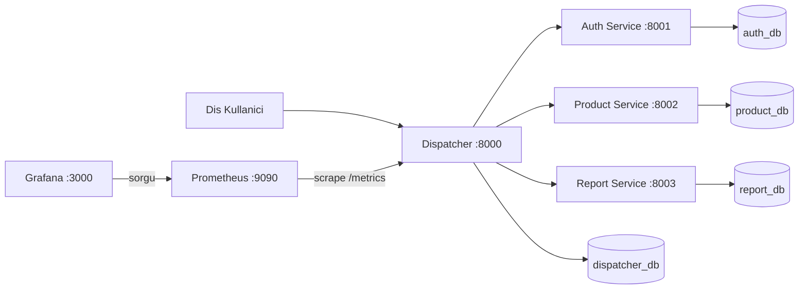
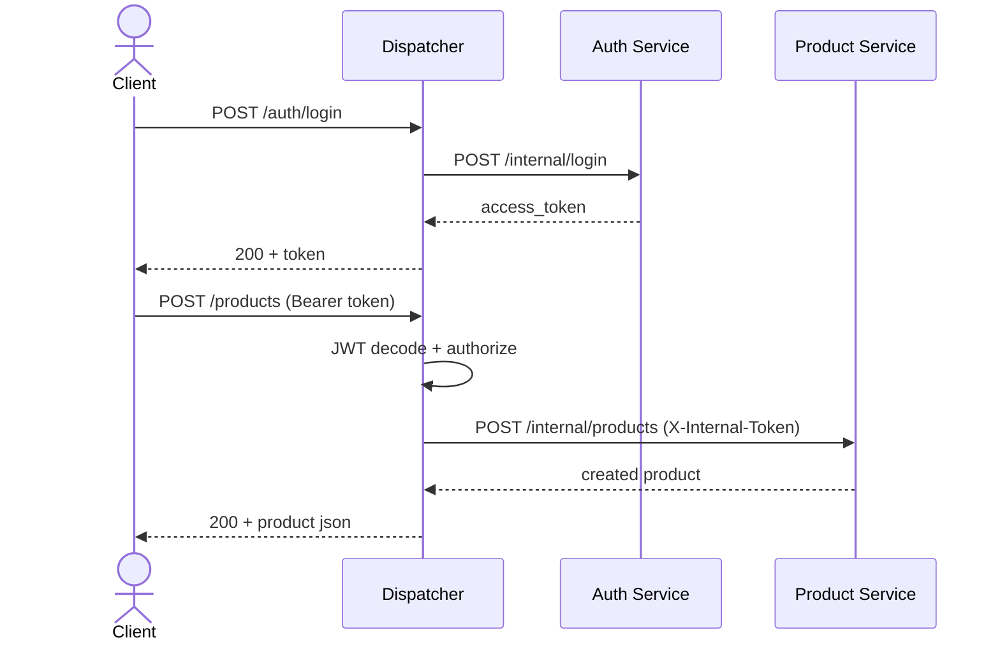
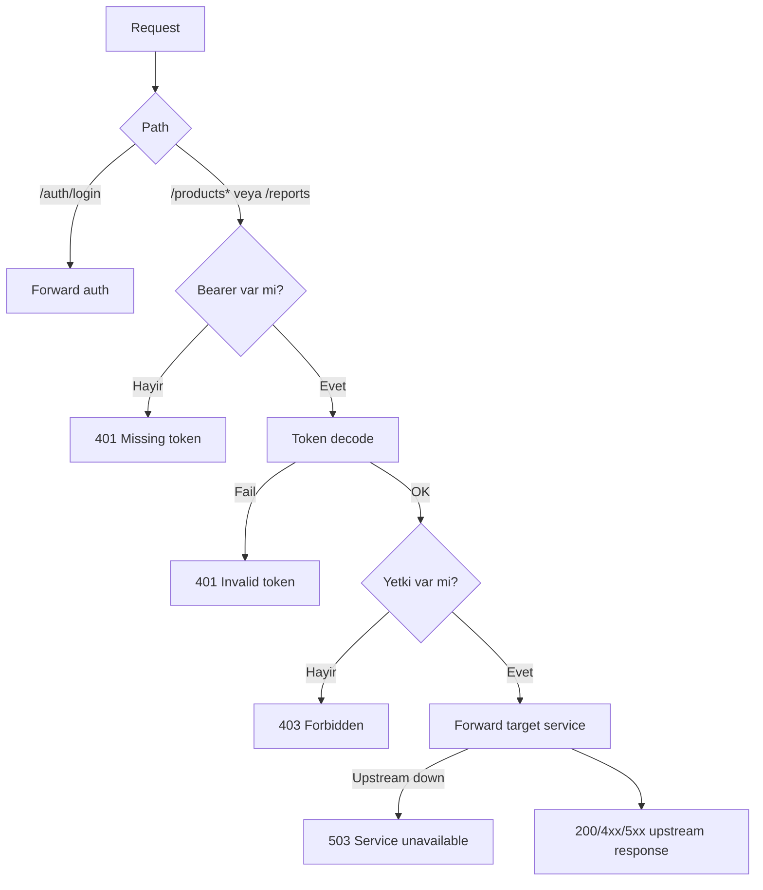

# YazLab II - Proje 1

Bu depo, mikroservis mimarisi + Dispatcher (API Gateway) gereksinimleri icin baslangic iskeletidir.

## Mimari

- `dispatcher`: Tek giris noktasi, yonlendirme + yetkilendirme + merkezi loglama
- `auth_service`: Oturum acma/JWT uretimi
- `product_service`: Urun CRUD mikroservisi
- `report_service`: Basit rapor mikroservisi
- Her servis icin ayri MongoDB konteyneri (veri izolasyonu)

## Hizli Baslangic

1. Docker Desktop kurulu ve acik olsun.
2. Proje kokunde:

```bash
docker compose up --build
```

3. Dispatcher uzerinden ornek istek:

```bash
curl -X POST http://localhost:8000/auth/login -H "Content-Type: application/json" -d "{\"username\":\"admin\",\"password\":\"admin123\"}"
```

## Dispatcher TDD Notu

Dispatcher testleri `dispatcher/tests/` altinda tutulur ve once test yazilip sonra kod gelistirilir.

### TDD Zaman Damgasi Kaniti (Red -> Green)

Asagidaki iki ardisk commit, testlerin fonksiyonel koddan once eklendigini gosteren ornek bir TDD dongusudur:

- `88fb3cc`: once testler eklendi (traffic-table limit davranisi)
- `0960e30`: sonra kod guncellenerek test beklentisi saglandi

Dogrulama komutlari:

```bash
git show --name-only 88fb3cc
git show --name-only 0960e30
```

## API Contract (RMM Seviye 2)

Tum dis dunya istekleri yalnizca Dispatcher uzerinden yapilir.

### Auth

- `POST /auth/login`
  - Request:
    - `{"username":"admin","password":"admin123"}`
  - Responses:
    - `200`: `{"access_token":"...","token_type":"bearer"}`
    - `401`: gecersiz kimlik bilgisi
    - `400`: gecersiz JSON
    - `503`: auth servisi ulasilamaz

### Products

- `GET /products`
  - Header: `Authorization: Bearer <token>`
  - Responses: `200`, `401`, `403`, `503`

- `GET /products/{id}`
  - Header: `Authorization: Bearer <token>`
  - Responses: `200`, `401`, `403`, `404`, `503`

- `POST /products`
  - Header: `Authorization: Bearer <token>`
  - Request:
    - `{"name":"Kalem","price":10.5,"stock":100}`
  - Responses: `200`, `400`, `401`, `403`, `503`

- `PUT /products/{id}`
  - Header: `Authorization: Bearer <token>`
  - Request:
    - `{"name":"Kalem","price":12.0,"stock":80}`
  - Responses: `200`, `400`, `401`, `403`, `404`, `503`

- `DELETE /products/{id}`
  - Header: `Authorization: Bearer <token>`
  - Responses: `200`, `401`, `403`, `404`, `503`

### Reports

- `GET /reports`
  - Header: `Authorization: Bearer <token>`
  - Responses: `200`, `401`, `403`, `503`

## k6 Yük Testi

### Amac

Dispatcher'in 50/100/200/500 eszamanli kullanici altinda:
- yanit suresi,
- hata orani,
- yonlendirme basarisini olcmek.

### Calistirma

1. Sistem ayakta olsun:

```bash
docker compose up --build -d
```

2. k6 kuruluysa PowerShell'de:

```powershell
.\load-tests\run-k6.ps1
```

Alternatif tek komut:

```powershell
k6 run --env BASE_URL=http://localhost:8000 --env USERNAME=admin --env PASSWORD=admin123 --summary-export .\load-tests\k6-summary.json .\load-tests\k6-load.js
```

### Cikti

- Konsolda:
  - `http_req_duration` (ort, p95)
  - `http_req_failed` (hata orani)
  - `checks` (dogrulama basari orani)
- Dosya:
  - `load-tests/k6-summary.json`

### Rapor icin onerilen tablo

| Eszamanli Kullanici | Ortalama Sure (ms) | p95 (ms) | Hata Orani |
|---|---:|---:|---:|
| 50 | 908.21 | 3362.57 | 0.00% |
| 100 | 2099.40 | 5500.51 | 0.00% |
| 200 | 4092.59 | 10481.04 | 3.60% |
| 500 | 6884.46 | 13192.78 | 41.33% |

Not: Bu degerler yerel makinede yapilan testten alinmistir. Donanim ve ag kosullarina gore degisebilir.

## Grafana ve Trafik Gozlemi

### Ne yapildi?

1. **Dispatcher** `GET /metrics` uzerinden Prometheus formatinda metrikler uretir.
2. **Prometheus** bu metrikleri periyodik olarak toplar (`http://prometheus:9090`).
3. **Grafana** Prometheus'u veri kaynagi olarak kullanir; hazir panelde istek hizi ve p95 gecikme grafikleri gorunur.
4. **Detayli log tablosu**: `GET /dispatcher/traffic-table` (Bearer `admin` token) ile son 200 istek HTML tablosu olarak acilir.

### Adresler

| Servis | URL | Not |
|--------|-----|-----|
| Grafana | http://localhost:3000 | Kullanici: `admin`, parola: `admin123` |
| Prometheus | http://localhost:9090 | Sorgu ve hedef kontrolu |
| Dispatcher metrikleri | http://localhost:8000/metrics | Prometheus scrape |
| Trafik tablosu | http://localhost:8000/dispatcher/traffic-table | Header: `Authorization: Bearer <token>` (admin) |

Grafana'da sol menuden **Dashboards** -> **Dispatcher Genel Bakis** panelini acin. Trafik urettikten sonra grafiklerin dolmasi bir kac dakika surebilir.

### Sorun Giderme

- `docker compose up --build` sirasinda servisler acilmiyorsa:
  - `docker compose ps` ile durumlari kontrol edin.
  - `docker compose logs dispatcher` ile hata detayina bakin.
- Grafana bos gorunuyorsa:
  - once API trafigi uretin (`test-api.ps1`).
  - Prometheus hedefinde `dispatcher:8000` durumu `UP` olmali.
- `k6` komutu taninmiyorsa:
  - yeni terminal acin veya `C:\\Program Files\\k6\\k6.exe` ile calistirin.
- `Missing token` hatasi normaldir:
  - korumali endpointler icin `Authorization: Bearer <token>` zorunludur.

## Sistem Tasarimi ve Diyagramlar

### Konteyner Mimarisi (Mermaid)



### Login + Urun Olusturma Sequence



### Dispatcher Akisi



## Test Senaryolari ve Sonuclar

### Dispatcher TDD Kapsami

- Token yok -> `401`
- Gecersiz token -> `401`
- Yetki yok -> `403`
- Gecersiz JSON body -> `400`
- Upstream erisilemez -> `503`
- Gecerli token + uygun rota -> basarili yonlendirme

Son durum: `dispatcher` testleri `11 passed` (metrik endpointi dahil).

### Yük Testi Degerlendirmesi

- 50 ve 100 kullanicida hata orani `%0`.
- 200 kullanicida hata orani `%3.60` seviyesine cikiyor.
- 500 kullanicida gecikme ve hata orani belirgin artiyor (`%41.33`).
- Bu sonuc, mevcut tek dispatcher + senkron cagri modelinin daha yuksek yukte optimizasyona ihtiyac duydugunu gosteriyor.

## Sonuc ve Tartisma

Bu proje, mikroservis + API Gateway yapisinin temel isterlerini saglayan bir cekirdek sunmaktadir:

- Tum dis trafik tek noktadan (`dispatcher`) yonetilir.
- Her servis kendi veritabanina baglidir (veri izolasyonu).
- Yetkilendirme dispatcher merkezlidir; mikroservisler ic token olmadan erisimi reddeder.
- Docker Compose ile tum sistem tek komutla ayaga kalkar.
- Dispatcher TDD ile gelistirilmis ve kritik hata kodu davranislari testle guvenceye alinmistir.

### Sinirliliklar

- 500 VU seviyesinde gecikme ve hata orani yuksektir.
- Grafana panelleri temel metriklerle sinirlidir (ileri seviye alarm/alert yok).
- `on_event` kullanimindan dolayi FastAPI deprecation uyarisi alinmaktadir.

### Gelecek Gelistirmeler

- Async/non-blocking iyilestirmeler ve connection pool tuning
- Grafana'da alarm kurallari ve daha fazla panel
- Rate limit ve circuit breaker mekanizmalari
- Lifespan API'ye gecis ve test kapsaminin daha da genisletilmesi
