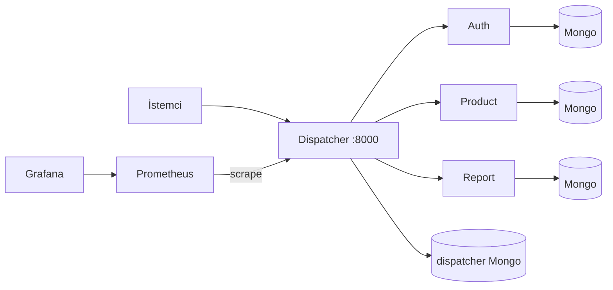

# YazLab II — Proje 1

## Ne yaptık?

**Dispatcher**’ı dış dünyanın tek gördüğü kapı yaptık: istekleri yola göre **auth**, **product** veya **report** servisine yönlendiriyoruz. Kimlik doğrulama ve yetkiyi burada topladık — JWT’yi çözüyoruz, kuralları **MongoDB**’deki `access_rules` koleksiyonundan okuyoruz; yetkisiz isteklerde **401/403**, bozuk gövdede **400**, servis cevap vermezse **503** dönüyoruz (her şeyi 200’de JSON hata ile saklamıyoruz). Gelen giden trafiği de Mongo’da **traffic_logs** ile tutuyoruz; admin için HTML **trafik tablosu** ucu var.

**Auth** iç login ile token üretiyor; **product** ürün CRUD, **report** rapor listesi sunuyor. Üç servisin de kendi **Mongo** konteyneri var; veri birbirine karışmıyor. Mikroservisleri host’a port açmadan sadece Docker ağında bıraktık; dışarıdan yalnızca dispatcher (ve izleme için Grafana/Prometheus) erişilebilir — iç çağrılarda **X-Internal-Token** kullanıyoruz.

API tarafında kaynakları URI ve **GET/POST/PUT/DELETE** ile konuşacak şekilde kurguladık (**RMM Seviye 2** çizgisinde). Altyapıyı **Docker Compose** ile tek komutta kaldırıyoruz; **Prometheus** dispatcher `/metrics` topluyor, **Grafana**’da panel var. Yükü **k6** ile denedik; Dispatcher tarafını **pytest** ile yazdık ve TDD için en az bir döngüde testleri koddan önce commit’ledik (`88fb3cc` → `0960e30`).

## Çalıştırma

Docker Desktop açık olsun, proje kökünde:

```bash
docker compose up --build
```

Windows: `.\CALISTIR.ps1` (hazır olana kadar bekler).

- Bilgi sayfası: http://127.0.0.1:8000/
- Swagger: http://127.0.0.1:8000/docs
- Grafana: http://localhost:3000 (`admin` / `admin123`)

```bash
curl -X POST http://localhost:8000/auth/login -H "Content-Type: application/json" -d "{\"username\":\"admin\",\"password\":\"admin123\"}"
```

## Klasörler

| Klasör | Rol |
|--------|-----|
| `dispatcher/` | Gateway, yetki, log, `/metrics` |
| `auth_service/` | Login, JWT |
| `product_service/`, `report_service/` | İş servisleri |
| `load-tests/` | k6 |
| `observability/` | Prometheus + Grafana |
| `teslim/` | Rapor / teslim dosyaları (yerel) |

## Mimari (Mermaid)



## Notlar

- Yük testi: `.\load-tests\run-k6.ps1`
- Testler: `docker compose exec dispatcher pytest tests -v`
