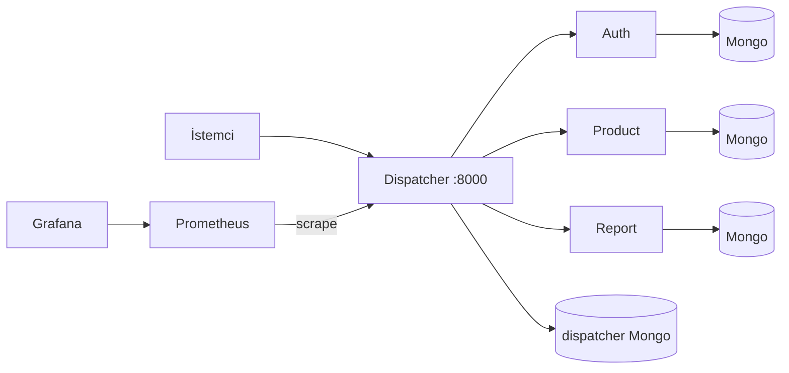

# YazLab II — Proje 1

| Ders | Yazılım Geliştirme Lab. II (2025–2026 Bahar) |
|------|-----------------------------------------------|
| Grup | **47** |
| Repo | [elifaysan/YAZ_lab](https://github.com/elifaysan/YAZ_lab) |

**Ekip:** Elif Aysan (221307008), Sinem Gül (221307027)

---

## Ne yaptık?

Mikroservis + **Dispatcher (API Gateway)** ödevi: dış trafik tek kapıdan giriyor, JWT ve Mongo’daki kurallarla yetki burada; **auth**, **product**, **report** servisleri ayrı **MongoDB** ile çalışıyor. Hepsi **Docker Compose** ile kalkıyor; yanında **Prometheus / Grafana**, **k6** yük testi ve Dispatcher için **pytest + TDD** kullandık.

Ayrıntılı mimari, literatür, API/RMM açıklaması, test ve yük sonuçları **yazılı raporumuzda** (Word/Markdown teslim); burada sadece repoyu özetliyoruz.

## Çalıştırma

Docker Desktop açık olsun, proje kökünde:

```bash
docker compose up --build
```

Windows’ta hazır script: `.\CALISTIR.ps1` (bekleyip hazır olunca bilgi veriyor).

- Bilgi sayfası: http://127.0.0.1:8000/
- API dokümantasyonu: http://127.0.0.1:8000/docs
- Grafana: http://localhost:3000 (`admin` / `admin123`)

Örnek login:

```bash
curl -X POST http://localhost:8000/auth/login -H "Content-Type: application/json" -d "{\"username\":\"admin\",\"password\":\"admin123\"}"
```

## Klasörler

| Klasör | Rol |
|--------|-----|
| `dispatcher/` | API Gateway, yetki, log, `/metrics` |
| `auth_service/` | Giriş, JWT |
| `product_service/`, `report_service/` | İş servisleri |
| `load-tests/` | k6 betikleri |
| `observability/` | Prometheus + Grafana ayarı |
| `teslim/` | Rapor taslağı, teslim betikleri (yerelde) |

## Mimari özeti (Mermaid)



## Kısa notlar

- **TDD (Dispatcher):** Örnek red→green commit zinciri: `88fb3cc` → `0960e30` (`git show` ile bakılabilir).
- **Yük testi:** `.\load-tests\run-k6.ps1` — ayrıntılı tablo ve yorum raporda.
- **Testler:** `docker compose exec dispatcher pytest tests -v`
