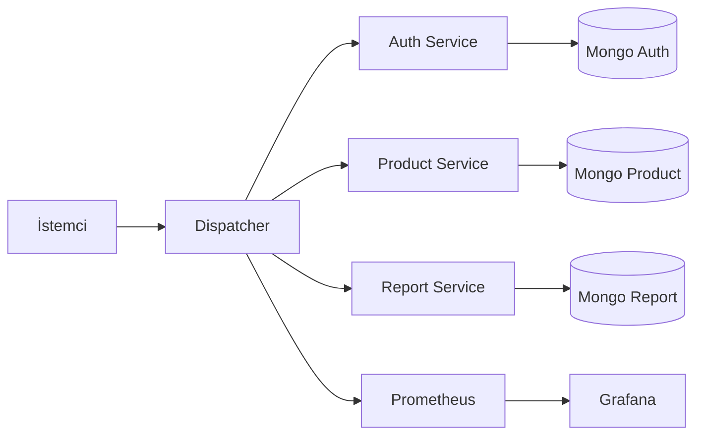
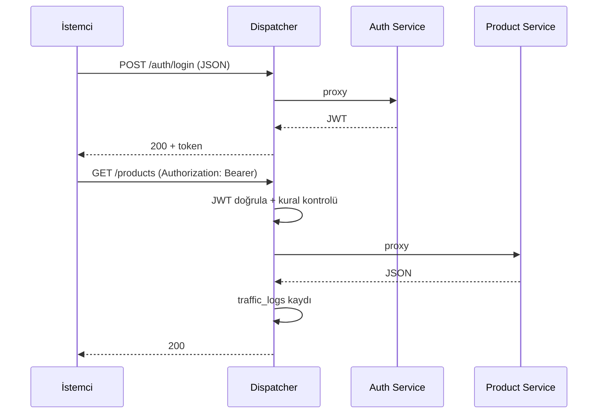

# Yazılım Geliştirme Laboratuvarı-II — Proje 1  
## Mikroservis Mimarisi ve API Gateway (Dispatcher)

| Alan | Değer |
|------|--------|
| **Ders** | YazLab II — 2025–2026 Bahar |
| **Proje** | Proje I |
| **Grup No** | **47** |
| **Öğrenciler** | Elif Aysan — **221307008** · Sinem Gül — **221307027** |
| **Tarih** | 5 Nisan 2026 |
| **GitHub** | https://github.com/elifaysan/YAZ_lab |

---

## 1. Özet

Bu projede, birden çok bağımsız mikroservisin tek bir giriş noktası üzerinden yönetildiği bir sistem geliştirilmiştir. **Dispatcher (API Gateway)** tüm dış istekleri karşılar; kimlik doğrulama ve yetkilendirme burada merkezi olarak yapılır. Ürün ve rapor işlevleri ayrı servislere bölünmüştür; her servis kendi **NoSQL** veritabanını kullanarak veri izolasyonu sağlanmıştır. Sistem **Docker Compose** ile ayağa kalkar; **Prometheus** ve **Grafana** ile gözlemlenebilirlik, **k6** ile yük testi ve **pytest** ile (özellikle dispatcher için) otomatik testler desteklenir.

---

## 2. Amaç ve Kapsam

- REST tabanlı, kaynak odaklı API tasarımı (RMM Seviye 2’ye uyumlu kaynak ve HTTP yöntem kullanımı).
- Mikroservisler arası gevşek bağlılık; servislerin bağımsız ölçeklenebilirliği ve dağıtımı.
- Tek noktadan güvenlik: JWT doğrulama, rol tabanlı erişim kuralları, trafik loglama.
- Her servis için ayrı NoSQL örneği (mantıksal/ fiziksel izolasyon).
- Test edilebilir mimari: dispatcher için birim testleri; uçtan uca senaryolar için API ve yük testleri.

---

## 3. Literatür ve Kavramlar

### 3.1 Richardson Maturity Model (RMM)

REST API’lerin olgunluk seviyeleri genelde dört düzeyde özetlenir:

| Seviye | Özellik |
|--------|---------|
| 0 | Tek uç nokta, tek HTTP yöntemi (çoğunlukla POST) |
| 1 | Kaynaklara ayrı URI’ler |
| 2 | HTTP yöntemlerinin anlamlı kullanımı (GET/POST/PUT/DELETE) ve uygun durum kodları |
| 3 | HATEOAS (bağlantılarla keşfedilebilir API) |

Bu projede API’ler **Seviye 2** hedefiyle tasarlanmıştır: kaynak URI’leri, doğru HTTP fiilleri ve anlamlı durum kodları (200, 201, 400, 401, 403, 404, 503 vb.) kullanılır.

### 3.2 Mikroservis ve API Gateway

Mikroservis mimarisinde her iş kapabilitesi ayrı deploy edilebilir bir servistir. **API Gateway (Dispatcher)**, istemcilerin tek adresle konuşmasını, güvenlik politikalarının tek yerde uygulanmasını ve yönlendirme (routing) ile basit orkestrasyonu sağlar.

---

## 4. Sistem Mimarisi

### 4.1 Mantıksal mimari



### 4.2 Docker Compose bileşenleri

- **dispatcher**: FastAPI tabanlı ağ geçidi (port 8000).
- **auth_service**, **product_service**, **report_service**: İş mikroservisleri.
- **mongo_auth**, **mongo_product**, **mongo_report**: Servis başına ayrı MongoDB kapsayıcıları.
- **prometheus**, **grafana**: Metrik toplama ve paneller.

### 4.3 İstek akışı (özet)



---

## 5. Bileşenler ve Sorumluluklar

| Bileşen | Sorumluluk |
|---------|------------|
| **Dispatcher** | Yönlendirme, JWT doğrulama, `access_rules` ile yetki, `traffic_logs` ile log, `/metrics`, admin uçları |
| **Auth Service** | Kullanıcı doğrulama, token üretimi, kullanıcı/rol yönetimi ile ilgili uçlar |
| **Product Service** | Ürün CRUD, ürün verisi için ayrı MongoDB |
| **Report Service** | Raporlama verisi, ayrı MongoDB |

---

## 6. Veri ve Veritabanı Tasarımı

Her servis kendi MongoDB örneğine bağlanır; şema esnek (doküman tabanlı) olsa da koleksiyonlar iş kurallarına göre ayrılır.

**Dispatcher (mongo_auth ile paylaşılan veya ayrı yapılandırılabilir) örnek koleksiyonlar:**

- `access_rules`: Yol ön eki, HTTP metodu, gerekli roller.
- `traffic_logs`: Zaman damgası, kullanıcı, metot, yol, durum kodu, süre vb.

**Product / Report servisleri:** kendi Mongo örneklerinde ürün ve rapor dokümanları.

*Not: NoSQL için klasik ER diyagramı yerine yukarıdaki koleksiyon/kaynak ayrımı tercih edilmiştir.*

---

## 7. API Tasarımı (REST / RMM-2)

Örnek kaynaklar (özet):

| Kaynak / Önek | Metotlar | Açıklama |
|---------------|----------|----------|
| `/auth/login` | POST | Kimlik bilgisi ile token |
| `/products` | GET, POST | Liste / oluşturma |
| `/products/{id}` | GET, PUT, DELETE | Tekil ürün |
| Rapor uçları | GET/POST (servis tanımına göre) | Rapor servisi |

Dispatcher, dış dünyaya bu yolları proxy’ler; yetkisiz isteklerde **401/403**, hatalı gövdede **400**, aşağı akış kapalıysa **503** döndürülmesi hedeflenir.

---

## 8. Güvenlik ve İzolasyon

- **Kimlik doğrulama:** JWT; dispatcher token’ı doğrular.
- **Yetkilendirme:** MongoDB’deki kurallar ile yol + metot + rol eşlemesi.
- **Veri izolasyonu:** Servis başına ayrı MongoDB konteyneri / bağlantı dizesi.
- **Loglama:** İstek meta verileri `traffic_logs` içinde toplanır (uygun gizlilik ve kişisel veri politikası gözetilmelidir).

---

## 9. Test Stratejisi ve TDD

### 9.1 Dispatcher için TDD özeti

Önerilen kanıt zinciri (örnek commit sırası):

1. **Kırmızı:** Önce test yazılır (ör. trafik tablosu `limit` parametresi, yetkisiz erişim).
2. **Yeşil:** Dispatcher kodu testi geçecek şekilde güncellenir.
3. **Refactor:** Gerekirse sadeleştirme.

Projede ilgili testler `dispatcher/tests/` altında **pytest** ile çalıştırılır.

### 9.2 Test senaryoları (örnek başlıklar)

- Geçerli token ile izin verilen uçlara erişim.
- Token yok / geçersiz → 401.
- Rol yetersiz → 403.
- Geçersiz JSON gövdesi → 400.
- Üst servis yanıt vermez → 503.
- `/metrics` Prometheus formatı.
- Admin trafik tablosu: `limit` alt/üst sınırları.

---

## 10. Yük Testi (k6)

README ve `load-tests/` altındaki betiklerle **50, 100, 200, 500** sanal kullanıcı senaryoları koşturulabilir. Metrikler: istek süresi, hata oranı, throughput. Özet sonuçlar rapor tablosuna işlenir; ham büyük JSON çıktıları genelde `.gitignore` ile repodan hariç tutulur.

**Örnek sonuç tablosu (kendi koşumunuzla doldurun):**

| VUs | Ort. süre (ms) | p95 (ms) | Hata % |
|-----|----------------|----------|--------|
| 50 | *…* | *…* | *…* |
| 100 | *…* | *…* | *…* |
| 200 | *…* | *…* | *…* |
| 500 | *…* | *…* | *…* |

---

## 11. Gözlemlenebilirlik (Prometheus + Grafana)

- Dispatcher **Prometheus** metrikleri üretir (`/metrics`).
- **Grafana** ile paneller: istek hızı, gecikme, hata oranı (kurduğunuz dashboard’a göre).

### 11.1 Ekran görüntüsü alınacak yerler (adım adım)

**Ön koşul:** **Docker Desktop açık ve “Engine running”** olmalı. Kapalıysa tarayıcıda `localhost:8000`, Grafana veya pytest (konteyner) **çalışmaz**. Windows’ta proje kökünde `CALISTIR.ps1` çalıştırın: Docker’ı kontrol eder, stack’i kaldırır, dispatcher hazır olana kadar bekler.

Ardından **30–60 saniye** daha bekleyin (Prometheus / Grafana). Port **8000 / 3000 / 9090** başka uygulama tarafından kullanılıyorsa adresleri değiştirmeniz gerekir.

Aşağıdaki görselleri rapora **PNG veya JPG** olarak ekleyin.

| # | Konu | Adım | Adres / komut |
|---|------|------|----------------|
| **A** | **Proje giriş sayfası** | Tarayıcıda açın; grup ve öğrenci kartı tam görünsün. Çalışmazsa `http://127.0.0.1:8000/` deneyin. | `http://localhost:8000/` |
| **B** | **Grafana** | 1) `http://localhost:3000` → giriş: **admin** / **admin123**. 2) İlk açılışta şifre değiştirme ekranı çıkarsa yeni şifre verin veya atlayın (sürüme göre değişir). 3) Doğrudan hazır panele gidin (aşağıdaki link). 4) Grafikler boşsa tarayıcıda birkaç istek üretin: ana sayfa `http://localhost:8000/` veya Swagger `http://localhost:8000/docs` üzerinden `GET /products` (token ile); **15 dakika** zaman aralığı seçili olsun. | Panel: `http://localhost:3000/d/dispatcher-overview/dispatcher-genel-bakis` |
| **C** | **Trafik tablosu** | **Önerilen (PowerShell):** Aşağıdaki komutlar token alır, HTML’yi diske yazar ve varsayılan tarayıcıda açar; tablonun ekran görüntüsünü alın. | Komutlar §11.2 |
| **D** | **k6 özeti** | Bilgisayarda **k6 kurulu** olmalı (`k6 version`). Stack ayakta iken proje kökünde `.\load-tests\run-k6.ps1`. Özet terminalde; ayrıca `load-tests\k6-summary.json` oluşur. | `.\load-tests\run-k6.ps1` |
| **E** | **pytest** | Dispatcher konteynerinde çalıştırın (aşağıdaki komut). `passed` sayısı görünsün. | `docker compose exec dispatcher pytest tests -v` |

**Swagger ile trafik tablosu (alternatif):** `http://localhost:8000/docs` → **Authorize** → kutuya **yalnızca JWT’yi** yapıştırın (**`Bearer ` yazmayın**; arayüz kendisi ekler). `GET /dispatcher/traffic-table` → **Execute**. Yanıt `text/html` ise gövde önizlemesinden veya “Download” ile tam sayfa gibi ekran görüntüsü alın.

**Rapora sıra:** A → B → C → D → E.

### 11.2 Trafik tablosu — PowerShell (Windows)

**En kolayı:** proje kökünde (stack ayakta iken):

```powershell
powershell -ExecutionPolicy Bypass -File .\teslim\trafik_tablosu_ac.ps1
```

Aynı işi elle yapmak için (`127.0.0.1` genelde `localhost` sorunlarını azaltır):

```powershell
$body = '{"username":"admin","password":"admin123"}'
$r = Invoke-RestMethod -Uri "http://127.0.0.1:8000/auth/login" -Method Post -ContentType "application/json; charset=utf-8" -Body $body
$htmlPath = Join-Path $env:TEMP "dispatcher-traffic.html"
Invoke-WebRequest -Uri "http://127.0.0.1:8000/dispatcher/traffic-table?limit=50" -Headers @{ Authorization = "Bearer $($r.access_token)" } -OutFile $htmlPath
Start-Process $htmlPath
```

Açılan sayfada tabloyu yakalayın.

### 11.3 Word raporu

Proje kökünde: `powershell -ExecutionPolicy Bypass -File .\teslim\WORD_RAPOR_OLUSTUR.ps1` (Python kurulu olmalı). Çıktı: `teslim/RAPOR_Grup47_YazLab2_Proje1.docx`.

**Yer tutucu satırlar (PDF’e görsel ekledikten sonra silebilirsiniz):**

1. Proje giriş sayfası — `ss-01-localhost-8000.png`
2. Grafana — `ss-02-grafana.png`
3. Trafik tablosu — `ss-03-traffic-table.png`
4. k6 özeti — `ss-04-k6.png`
5. pytest — `ss-05-pytest.png`

---

## 12. Kurulum ve Çalıştırma (Özet)

```bash
docker compose up --build
```

- API Gateway: `http://localhost:8000` (README ile uyumlu olmalıdır).
- Testler: `docker compose exec dispatcher pytest tests -v` (konteyner içi çalışma dizini `/app`; test klasörü `tests/`).

---

## 13. Sonuç ve Değerlendirme

Bu çalışmada mikroservisler ayrıştırılmış, güvenlik ve loglama dispatcher’da merkezileştirilmiş ve servis başına veri izolasyonu sağlanmıştır. REST olgunluk düzeyi 2 hedefiyle uyumlu HTTP kullanımı, otomatik testler ve yük testleri ile sistem davranışı ölçülebilir hale getirilmiştir. Gelecekte HATEOAS (RMM-3), dağıtık izleme (trace ID) ve daha ayrıntılı SLO/alert kuralları eklenebilir.

---

## 14. Teslim Kontrol Listesi (Ödev Metnine Göre)

| Gereksinim | Durum / Not |
|------------|-------------|
| Kaynak kodların tek `.txt` dosyasında alt alta birleştirilmesi | `teslim/olustur_kaynakkod.ps1 -GrupNo 47` → `teslim/47_yazlab2_kaynakkod.txt` |
| GitHub adresinin yazılı olduğu metin dosyası | `teslim/github_adresi.txt` |
| Kod ve raporun teslim öncesi GitHub’da olması | Depo: https://github.com/elifaysan/YAZ_lab |
| Bu rapor | Markdown: `teslim/RAPOR_YazLab2_Proje1.md` · Word: `teslim/WORD_RAPOR_OLUSTUR.ps1` veya `python teslim/build_rapor_word.py` |

**Kapak:** Grup **47** — Elif Aysan **221307008**, Sinem Gül **221307027**. Word dosyası ürettikten sonra Word’de ekran görüntülerini ilgili bölümlere yapıştırabilirsiniz.

---

## Kaynakça (Örnek)

- Fielding, R. T. — Architectural Styles and the Design of Network-based Software Architectures (REST doktora tezi, 2000).
- Richardson, L. — Richardson Maturity Model (REST API olgunluk modeli).
- Newman, S. — *Building Microservices* (O’Reilly).
- FastAPI, MongoDB, Prometheus, Grafana, k6 resmi dokümantasyonları.

---

*Bu belge proje deposunun `teslim/` klasöründe tutulur; teslim formatına göre PDF veya istenen ortama aktarılabilir.*
